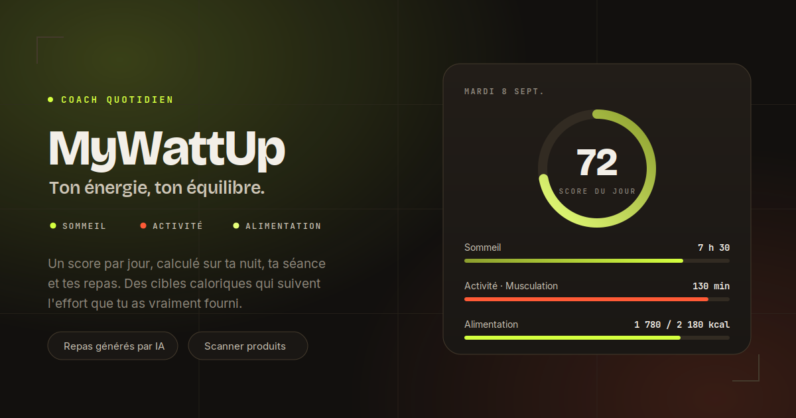

<p align="center">
  
</p>

<h1 align="center">MyWattUp</h1>

<p align="center">
  <b>Ton coach santé quotidien.</b><br />
  Sommeil, activité et alimentation croisés en un seul score, avec des conseils qui tiennent compte de ta journée réelle.
</p>

<p align="center">
  🔗 <a href="https://my-watt-up.vercel.app"><b>my-watt-up.vercel.app</b></a>
</p>

<p align="center">
  
  
  
  
  
</p>

---

## ✨ Fonctionnalités

<table>
<tr>
<td width="50%" valign="top">

### 📓 Journal du jour
Saisie guidée en 5 étapes : sommeil, séance, repas, forme, récap. Le brouillon est sauvegardé en continu — quitter la page ne fait plus perdre la saisie. Note perso et historique des 7 derniers jours.

</td>
<td width="50%" valign="top">

### ⚡ Score quotidien
Une note sur 100 calculée sur la durée et la qualité du sommeil, le type et l'intensité de la séance, et la forme ressentie. Courbe d'évolution sur 7 ou 30 jours.

</td>
</tr>
<tr>
<td width="50%" valign="top">

### 🤖 Conseil IA
Une recommandation courte et actionnable chaque jour, calée sur ton journal, ton sport et ton objectif. Jamais de diagnostic : le prompt interdit explicitement le terrain médical.

</td>
<td width="50%" valign="top">

### 🍽️ Repas du jour
Trois repas générés selon tes besoins caloriques réels, ton objectif, tes allergies et la séance que tu as effectivement faite. Anti-répétition sur 21 jours.

</td>
</tr>
<tr>
<td width="50%" valign="top">

### 🔢 Suivi calorique en langage naturel
Tu écris « steak frites » ou « un bol de riz et 150 g de poulet » — calories et macros sont estimées automatiquement. Plus aucun champ chiffré à remplir.

</td>
<td width="50%" valign="top">

### 📷 Scanner de produits
Code-barres lu via Open Food Facts, avec un score recalculé selon ton profil sportif et ton objectif — pas une note générique.

</td>
</tr>
</table>

---

## 📱 Aperçu

<p align="center">
  
</p>

<p align="center"><i>Journal guidé · Score et courbe d'évolution · Repas calés sur la séance</i></p>

---

## 🛠️ Stack technique

- **Frontend :** HTML / CSS / JS vanilla, single-file (`index.html`), PWA installable (manifest + service worker)
- **Backend :** Supabase — PostgreSQL, Auth, Row Level Security
- **Fonctions serveur :** Vercel Serverless Functions (Node)
- **IA :** Groq (`openai/gpt-oss-120b`) — le générateur de repas détecte automatiquement le fournisseur disponible (Anthropic, OpenAI, OpenRouter, Mistral, Groq, Gemini)
- **Paiement :** Stripe
- **Données produits :** Open Food Facts

Aucun bundler, aucun framework. Le front est servi tel quel.

---

## 📂 Structure

```
├── api/                    # Fonctions serverless
│   ├── coach-advice.js     # Conseil IA du jour
│   ├── generate-meals.js   # Génération des 3 repas
│   └── estimate-food.js    # Estimation kcal + macros
├── css/  icons/  js/
├── index.html              # Application complète
├── auth.js                 # Connexion / inscription
├── onboarding.js           # Création du profil
├── supabaseClient.js
├── sw.js  manifest.json    # PWA
└── politique-confidentialite.html
```

---

## 🧮 Comment les calories sont calculées

**Base :** Mifflin-St Jeor × facteur d'activité du profil, ajusté selon l'objectif.

**Modulation par la séance du jour :** les calories brûlées ne sont **pas additionnées**. Le facteur d'activité les inclut déjà par définition — les recompter surestimerait la dépense de plusieurs centaines de kcal par jour. La cible varie donc *autour* de cette base, dans une fourchette bornée : **−8 % un jour de repos, +12 % au maximum sur une grosse séance**. Les glucides absorbent la variation, les protéines ne bougent pas.

**Garde-fous :**
- aucun déficit si l'IMC est sous 18,5 ou avant 18 ans
- cible jamais sous le métabolisme de base, ni sous les repères bas de l'adulte
- protéines calculées sur un poids de référence plafonné à IMC 25

Le suivi calorique et le générateur de repas partagent **la même fonction de calcul** : les deux chiffres racontent toujours la même journée.

---

## 💳 Offres

|  | Gratuit | **Pro — 9,99 €/mois** |
|---|:---:|:---:|
| Conseil IA | 1 / jour | illimité |
| Génération de repas | 1 / jour | illimité |
| Estimation d'aliments | 20 / jour | illimité |
| Scans produits | 5 / jour | illimité |

---

## 🔒 Sécurité

- **RLS activée** sur toutes les tables utilisateur
- La clé `service_role` **ne quitte jamais le serveur** — le front n'utilise que la clé publique
- Tout endpoint qui écrit avec la clé service role **vérifie d'abord le jeton de l'appelant**
- Le contenu des prompts est **relu en base**, jamais accepté depuis le body : sinon l'endpoint devient un LLM gratuit
- Les champs libres sont neutralisés avant d'entrer dans un prompt (sauts de ligne, marqueurs de rôle, bornage)
- Les valeurs renvoyées par les modèles sont **plafonnées côté serveur** avant enregistrement
- Contraintes `CHECK` sur les données de santé : le `maxlength` du navigateur ne protège rien contre un appel direct à l'API

---

## 🚀 Développement local

```bash
npm install -g vercel
vercel env pull .env.local
vercel dev
```

> `vercel dev` sert le front **et** les fonctions du dossier `api/`.
> Ouvrir `index.html` directement dans le navigateur laisse les endpoints hors service.

**Variables requises :** `SUPABASE_URL`, `SUPABASE_SERVICE_ROLE_KEY`, `GROQ_API_KEY`, `STRIPE_SECRET_KEY`, `STRIPE_WEBHOOK_SECRET`.

Chaque commit sur `main` déclenche un déploiement Vercel automatique.

---

## ⚠️ Avertissement

MyWattUp fournit des **estimations et des repères**, pas des prescriptions. Les cibles caloriques, les repas et les conseils générés ne remplacent ni un médecin, ni un diététicien, ni un coach. En cas de pathologie connue, de grossesse, ou pour un objectif de perte de poids important, consulte un professionnel de santé.

---

## 👤 Auteur

Développé par [Osman](https://github.com/mmr45), apprenti peintre en bâtiment et développeur autodidacte.
